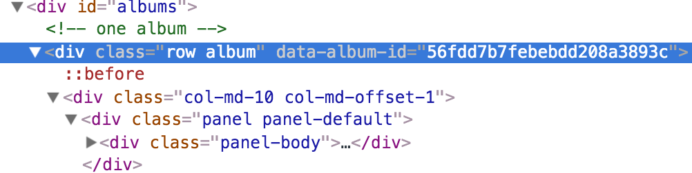

# Tune.ly Sprint 3

## Overview

This sprint we will:
* add a Song resource
* update the `Album` model to include embedded songs
* change the UI to allow users to see songs in an album

> Note: if you get stuck going through this, make use of the hints, your neighbors, and the solutions for sprint 3.

> You must complete all of the previous sprint before starting this sprint (excluding stretch challenges).

In this step, we'll be changing our album schema to have an embedded array of songs.

The data from the database will look a little like this:

```js
{ genres: [ 'new wave', 'indie rock', 'synth pop' ],
    songs:
     [ { _id: a665ff1678209c64e51b4e6a,
         trackNumber: 1,
         name: 'Swamped' },
       { _id: a665ff1678209c64e51b4e64,
         trackNumber: 7,
         name: 'Tight Rope' } ],
    _id: a665ff1678209c64e51b4e63,
    releaseDate: '2008, November 18',
    name: 'Comalies',
    artistName: 'Lacuna Coil',
    __v: 0 },
```

> In the output above, you can see that `songs` has been added and is an array of MongoDB documents!


## Step 1: Create the new model.

We're going to create an embedded model for songs and embed it in albums.  We've chosen to embed songs because albums usually have unique songs on them.  

1. Create a `models/song.js` file.

1. Open the file and create a song schema with properties including:

```js
  name: String,
  trackNumber: Number
```

1. Use your schema to create a `Song` model.

1. Export the `Song` model, and require it in `models/index.js`.

1. Require `./song.js` in `./albums.js`.

1. Alter the `AlbumSchema` to have a `songs` array that uses the song schema (available through the model as `Song.schema`).

> You may have seen embedded models defined in the same file as the model that it's embedded in; that's OK.  Here we're building it in a separate file.

## Step 2: Seeding Songs

Let's add song seeds.  Some basic data is provided for you in a [code sample](/docs/code_samples/sprint3_song_seeds.js).


We're going to use this same data for all albums for now, even though obviously not all albums actually have the same list of songs.

1. Copy the sample songs into `seed.js`.

1. Write a `forEach` call to add the sample songs to every sample album in the array in `seed.js`.  
1. Run `node seed.js`

1. Fix any issues you encounter, until you can see that your seed file is also adding songs for each album.  

## Step 3: Display Songs

Let's go back to `app.js` and our HTML.  If you check the output of your AJAX call, you should see that we're already retrieving songs with each album just because of the embedded structure we've set up on the back-end.  Before you proceed, double-check this by logging the response in the browser console.  

We'd like to list songs along with each album.  For now, keep this simple using HTML something like:

```html
<li class="list-group-item">
  <h4 class="inline-header">Songs:</h4>
  <span>	– (1) Swamped – (2) Heaven's a Lie – (3) Daylight Dancer – (4) Humane – (5) Self Deception – (6) Aeon – (7) Tight Rope – </span>
</li>
```

1. Modify the handlebars template in your HTML to include a portion that will fill in all the songs for the album. You won't need a new `<script>` tag since the song list will be a part of each album. Also, you shouldn't need to change the client-side code in `app.js` because it's already rendering the full album template.


  Hint: use `#each` from Handlebars to template each song's track number and name.


  > Check the solution for this step if you're struggling with the template.

1. Test to make sure this is working. Once your template is set, you should see the songs listed under each album on the page.

## Step 4: Create Songs

Now let's create the functionality to add new songs.  To do this, we're going to use a button to open a modal with some inputs. A "modal" section of the page is one that can be shown or hidden with a button and usually pops up over the rest of the content.


The Bootstrap modal is already setup for you in `index.html`.  We will have to add a button to each album to trigger its modal.  Also, since the same modal will be used for creating a song for _any_ album, we'll have to track which album we're supposed to be adding a song too.


We're going to track this by setting a `data` attribute called `album-id` on the modal itself.  We will set this attribute every time we display the modal.  

Here's pseudocode:

```
// this function will be called when someone clicks a button to create a new song
//   it has to determine which album (in the DB) the song will go to
function handleNewSongButtonClick() {
  // get the current album's id from the row the button is in
  // set the album-id data attribute on the modal (jQuery)
  // display the modal
}
```


First, we need to make sure we have the album id so we can use it later.  To get started, we'll set a `data` attribute on each album row with its ID.

1. In the template HTML for each album, add a new `data-album-id` attribute to the top `<div class='row album'>`.

1. Set the value of that attribute to `album._id`.

1. Refresh the page and inspect the HTML in the browser.  Make sure the attribute is set and is different for each album. Here's an example:

  

1. Add a button inside the panel footer:

  [button inside panel footer](assets/images/sprint3_add_song_button.png).

	<detail><summary>button code</summary>
	```js
	<div class='panel-footer'>
	  <button class='btn btn-primary add-song'>Add Song</button>
	</div>
	```

    > CSS IDs must be unique, so we'll target each of these buttons with a compound CSS selector including the `add-song` class.

	</detail>


1. Use jQuery to bind an event handler to these buttons' click events.  Test it by having it `console.log` when there's a click.

1. In your click event handler, get the current album row's `data-album-id` attribute.

  > Hint: you may want to read the jQuery documentation for `parents` or `closest` and `data`.

  ```js
  $('#albums').on('click', '.add-song', function(e) {
      console.log('add-song clicked!');
      var id= $(this).closest('.album').data('album-id'); // "5665ff1678209c64e51b4e7b"
      console.log('id',id);
  });
  ```

  > This code might be new to you.  We've added a  CSS selector as a second argument to the `on` method.
  > Because the `.add-song` element is not going to be on the page at document-ready, our event listener cannot bind to it at that time.
  > Instead, we'll bind to something above it in the DOM tree, like `body` or `#albums`. As long as that element is on the page when we add our event listener, we will be able to capture the click. Then, if it's on an element with class `.add-song`, jQuery will trigger this event handler.


1.  Set the data attribute `album-id` on the `#songModal`.  We'll use this to keep track of which album the modal is referring to at any time.

  <detail><summary>Hint: setting `data-album-id`</summary>

  ```js
  $('#songModal').data('album-id', currentAlbumId);
  ```

  </detail>

1. You can open a Bootstrap modal by selecting it in jQuery and calling Bootstrap's `.modal()` function.  After setting the `data-album-id` attribute in your function, click your button to trigger the modal.  It should appear on screen!

  > Suggested reading: [Bootstrap docs on modal usage](http://getbootstrap.com/javascript/#modals-usage)

## Step 5:  Use input from modal.

We should now have a working modal that opens and closes, but it doesn't do anything else yet.

Let's add a function to handle saving a new song modal -- `POST` the input data as a new song. Here's pseudocode:

	```pseudo
	// call this when the save new song button is clicked
	function handleNewSongSubmit(e) {
	  e.preventDefault();
	  // get data from modal fields
	  // get album ID
	  // POST to SERVER
	  // clear form
	  // close modal
	  // update the correct album to show the new song
	}
	```

	> You don't have to fill in all of the code here just yet, read further.

  > Note that this modal doesn't actually contain a form. It's generally better practice to use a full form and handle the submit event.

1. Create the `handleNewSongSubmit` function with pseudocode comments and a `console.log` message. Test that it triggers when you expect it to. We'll fill it in over the next few steps.

1. We'll need the `album-id` in order to build the correct URL for the AJAX POST.  Our URL will eventually be like `http://localhost:3000/api/albums/:album_id/songs` -- we want to make sure we're adding each song to the right album.  In the `handleNewSongSubmit` function, get the correct id from the modal.  Build the path and save it as a variable.

1. Prepare the POST request with an AJAX call.  For data, make sure you get the `.val` from the input fields.  Don't forget to call `handleNewSongSubmit` when the modal button is clicked.

## Step 6: Route and controller for adding songs.

Of course, we need to add the POST route on the server.  We're going to be using `request.params` (URL parameters) this time since we'll need to add the song to a specific album.

1. In `controllers/albumsSongsController.js`, start building the `create` method. Get the album id from the request, and find the correct album in the database.


1. Configure the `POST` `'/api/albums/:album_id/songs'` route in `server.js` to use the  `create` function as its callback.

1. In your new  method, create the new  song with the data from the request, and add it to the proper album.  

1. Save your changes to the database, and respond to the client with JSON.

> Hint: when adding songs to the database, make sure that the `Song` model has been exported in `models/index.js`.

## Step 7: Display the newly created song on the page.

1. Add a `GET /api/albums/:album_id` route (to go with the `show` controller method in the albums controller). It should respond with the requested album including its songs.  Depending on your choice below, you may or may not need this right away.

	> You can easily test this route by finding a valid ID and then using postman, curl, or your browser console.

  To get back and display the created song on the page, you have a couple of options:

  **A)** Have `POST /api/albums/:album_id/songs` respond with only the newly created song, then make a request to `GET /api/albums/:album_id` to get the entire album and render that on the page.  (You'll need to add the `show` function in `albumsController` and the route above in `server.js`.)
  > This is a very common approach and probably the most standard.  
  > The solutions will take this route (and you're encouraged to as well).

  **OR**

  **B)** Have your `POST /api/albums/:album_id/songs` route return the entire album instead of just the song.  Then re-render the album on the page.

  > This has the advantage of reducing the number of requests from client to server.  But _usually_ the response to a request creating a resource would contain just the newly created document (not its parent).


1.  Close the modal automatically after the new song request has been made.

  > Hint: `$('#id-to-modal').modal('hide');`
  > [Bootstrap modal docs](http://getbootstrap.com/javascript/#modals)


## Stretch Challenges

1. Add `imageUrl` as an attribute of your albums.  Update everything to use it!

1. Add the remaining JSON API routes to **Read** songs:

  ```
  GET /api/albums/:album_id/songs/:id  (show)
  GET /api/albums/:album_id/songs      (index)
  ```

1. Add track length as a field for each song.  


## Conclusion

You should now have the following API routes at a minimum:

```
GET /api/albums
POST /api/albums
GET /api/albums/:id
POST /api/albums/:album_id/songs
```

You should also have a working app!  Congratulations!


